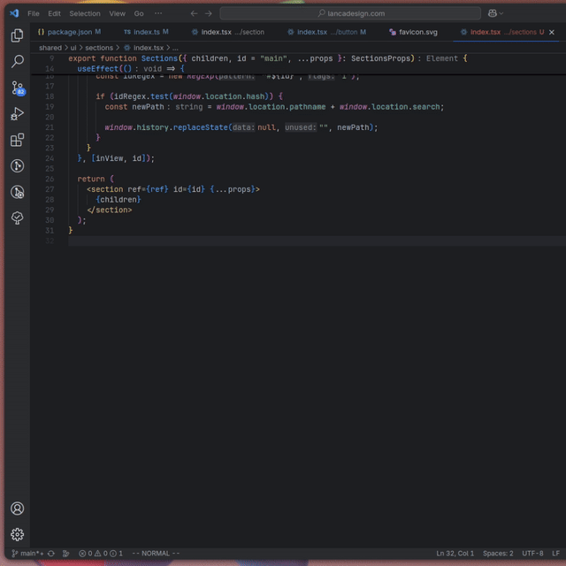
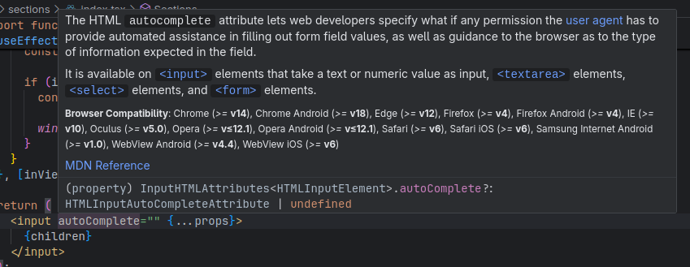

# MDN Docs (JSX/TSX) &mdash; MDN Docs for JSX/TSX

> Access **instant MDN documentation** directly within VS Code for HTML elements and attributes in your JSX/TSX files.

[MDN Docs (JSX/TSX)](https://github.com/joao-pedro-braz/mdn-docs 'Open MDN Docs on GitHub') is a extension for Visual Studio Code that bridges the gap between MDN Docs and HTML elements in JSX.

Hover over elements and attributes in your JSX/TSX files to instantly get the information you need.

## Getting Started

Install by clicking `Install` on the extension page, or from the Extensions sidebar in VS Code by searching for "MDN Docs (JSX/TSX)".

- The extension automatically activates when working with JSX/TSX files.
- No configuration required - it works out of the box!

## Features

MDN Docs provides immediate access to official MDN documentation through three main features:

- [**HTML Documentation**](#html-element-documentation) &mdash; Hover over any HTML element/attribute in JSX/TSX to view its complete documentation including browser compatibility.

## Element Documentation

Instantly see comprehensive information about any HTML element when you hover over it in your JSX/TSX files. Get details on proper usage and compatibility.

## Attribute Documentation

Get detailed information about element-specific attributes by hovering over them in your code.

## Configuration Options

MDN Docs can be customized with the following settings:

- **Language Selection**: Change the documentation language to any of nine supported languages including English, French, Spanish, Japanese, and more.
- **Enable/Disable**: Toggle the extension on/off as needed through settings.

## Multi-language Support

Access documentation in your preferred language by configuring the `mdn-docs.language` setting:

- English (US) - default
- Deutsch
- Español
- Français
- 日本語
- Português (do Brasil)
- Русский
- 中文 (简体)
- 正體中文 (繁體)

## Why MDN Docs?

- **Stay in Your Editor**: No more switching between VS Code and browser windows to look up documentation.
- **Immediate Knowledge**: Get answers instantly as you code.
- **Intelligent Context**: The extension recognizes the element/attribute context and provides appropriate documentation.
- **Automatic Caching**: Documentation is cached locally for faster access and offline usage.

## Technical Details

The extension uses the TypeScript Language Server to identify JSX/TSX elements and attributes, then fetches the relevant documentation from MDN. It also uses [`@mdn/browser-compat-data`](https://www.npmjs.com/package/@mdn/browser-compat-data) for the browser compatibility data All documentation is cleanly presented directly in VS Code's hover interface.

## License

This extension is available under the [MIT License](https://github.com/joao-pedro-braz/mdn-docs/blob/main/LICENSE.md).
